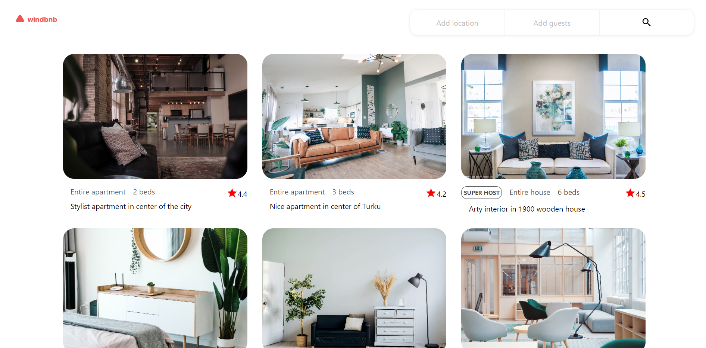

<h1 align="center">Wind bnb</h1>

<div align="center">
   Solution for a challenge from  <a href="http://devchallenges.io" target="_blank">Devchallenges.io</a>.
</div>

<div align="center">
  <h3>
    <a href="https://johnpalmgren.github.io/Windbnb"/>
      Demo
    </a>
    <span> | </span>
    <a href="https://github.com/johnpalmgren/Windbnb">
      Solution
    </a>
    <span> | </span>
    <a href="https://devchallenges.io/challenges/3JFYedSOZqAxYuOCNmYD">
      Challenge
    </a>
  </h3>
</div>

<!-- TABLE OF CONTENTS -->

## Table of Contents

- [Overview](#overview)
  - [Built With](#built-with)
- [Features](#features)
- [How to use](#how-to-use)
- [Contact](#contact)

<!-- OVERVIEW -->

## Overview



A react project to practice quickly putting together a responsive web page. 
It was a good chance to work with integrating responsive CSS into a react application
and using hooks such as useReducer.  

### Built With

<!-- This section should list any major frameworks that you built your project using. Here are a few examples.-->

- [React](https://reactjs.org/)


## Features

<!-- List the features of your application or follow the template. Don't share the figma file here :) -->

This application/site was created as a submission to a [DevChallenges](https://devchallenges.io/challenges) challenge. The [challenge](https://devchallenges.io/challenges/3JFYedSOZqAxYuOCNmYD) was to build an application to complete the given user stories.

Challenge: Create a small version of Airbnb - Windbnb with given data. Use Front-end libraries like React or Vue. Don’t look at the existing solution. Fulfill user stories below:

- User story: I can see a list of properties 
- User story: I can see the property card with a name, rating, apartment type, and super host 
- User story: I can open the filter drawer
- User story: I can filter properties by location and number of guests
- User story: I can see the number of filtered items
- User story: I can see pages following given designs

## How To Use

<!-- Example: -->

To clone and run this application, you'll need [Git](https://git-scm.com) and [Node.js](https://nodejs.org/en/download/) (which comes with [npm](http://npmjs.com)) installed on your computer. From your command line:

```bash
# Clone this repository
$ git clone https://github.com/your-user-name/your-project-name

# Install dependencies
$ npm install

# Run the app
$ npm start
```

## Contact

- Website [John Palmgren](https://portfoliositemain06643.gatsbyjs.io/)
- GitHub [@eniac01](https://{github.com/your-usermame})
